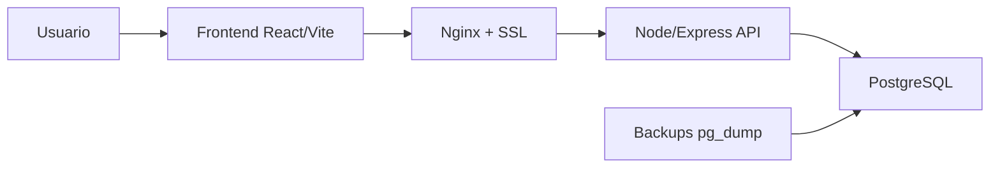

# Gestao Retiradas - Documentacao Tecnica

## Visao Geral

O sistema Retiradas opera com frontend React/Vite e backend proprio em VPS. A aplicacao nao depende mais de BaaS externo para login, leitura, escrita, importacoes ou paines operacionais.

## Arquitetura



## Dados

- `app_documents`: documentos operacionais em JSONB.
- `static_snapshots`: snapshots usados por dashboards e paines publicos.
- `app_users`: usuarios locais, senha hash e controle de sessao.
- `import_runs`: historico de importacoes JSONL.

## Autenticacao

O login usa `/api/auth/login` e tokens assinados pela VPS com `APP_AUTH_SECRET`.

Rotas administrativas exigem Bearer token e perfil permitido.

## Backups

Backups ficam em `/opt/retiradas/backups/postgres`.

Politica padrao:

- backup diario as 00:01;
- retencao de 30 arquivos;
- limite total de 10GB;
- rollback com confirmacao textual;
- backup de seguranca antes de restaurar.

## Deploy

Frontend:

```powershell
npm.cmd run build
scp -r .\dist\* root@145.223.27.204:/var/www/retiradas/dist/
```

API:

```powershell
scp .\vps\api\src\app.js root@145.223.27.204:/opt/retiradas/vps/api/src/app.js
```

Servidor:

```bash
chown -R www-data:www-data /opt/retiradas/vps /var/www/retiradas/dist
systemctl restart retiradas-api
curl https://retiradas.tech/api/health
```

## Migracao de nomes legados

Em ambientes que vieram da primeira carga de dados, rode uma vez:

```bash
psql -h 127.0.0.1 -U retorninho -d retiradas -f /opt/retiradas/vps/sql/003_rename_legacy_tables.sql
```
