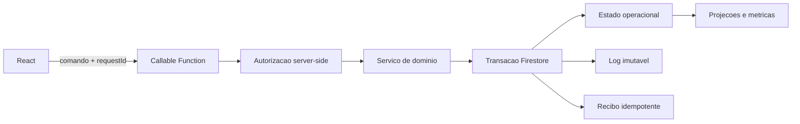

# Fase 1 - Bloqueadores P0

## Objetivo

Mover toda autoridade de negocio da esteira para Cloud Functions, fechar a
escrita direta no Firestore, tornar comandos idempotentes e produzir auditoria
imutavel no mesmo limite transacional da alteracao operacional.

Esta fase e um gate. As fases de escala, arquitetura e UX nao podem ser
consideradas iniciadas enquanto os criterios de saida deste documento nao forem
atendidos.

## Problema

O cliente React executa transacoes diretamente sobre blocos, catalogo, metricas
e logs. Ele tambem envia objetos de usuario para funcoes de dominio. Mesmo com
regras do Firestore, isso cria quatro falhas:

1. O navegador participa da decisao de autorizacao.
2. Estado operacional e auditoria podem divergir porque sao gravados em
   operacoes separadas.
3. Uma repeticao por timeout ou duplo clique pode executar o comando novamente.
4. Cada tela precisa reproduzir regras de transicao, aumentando divergencia.

O impacto de negocio inclui reserva indevida, indicadores incorretos, perda de
rastreabilidade, conflito entre atendentes e ausencia de evidencia confiavel
para auditoria.

## Arquitetura alvo

O cliente envia apenas a intencao. UID, papel, nome e filial sao carregados do
documento `usuarios/{uid}`. O servico valida a transicao e grava estado, log e
recibo na mesma transacao.

## Decisoes

### Request ID

Cada comando recebe um `requestId` aleatorio. O recibo usa
`{uid}_{requestId}` como chave. Repeticoes devolvem o resultado anterior e nao
criam novo log.

Trade-off: a colecao de recibos cresce. Os documentos possuem `expires_at` e
devem usar a politica TTL do Firestore com retencao de sete dias.

### Auditoria

O log usa ID deterministico derivado do request ID e e criado na transacao. O
cliente nao informa ator, papel ou horario.

Trade-off: relatorios antigos precisam aceitar `schema_version` 1 e 2 durante a
migracao. Depois da migracao, apenas a versao 2 sera produzida.

### Catalogo legado

Reserva e desreserva ainda atualizam o documento de catalogo para manter a tela
atual compativel. O catalogo unico sera eliminado na Fase 2.

Trade-off: o documento quente permanece temporariamente. Remover agora exigiria
alterar simultaneamente leitura, modelo e interface, ampliando o risco do P0.

## Implementacao incremental

### Concluido neste incremento

- Autorizacao server-side baseada em `usuarios/{uid}`.
- Comando callable para reserva e desreserva.
- Idempotencia por recibo.
- Auditoria atomica.
- Janela de 30 minutos validada no servidor.
- Override administrativo validado no servidor.
- Cliente migrado para a Function.
- Regras com default deny e escrita direta bloqueada para blocos, catalogo,
  metricas, logs, agendamentos, recibos, indice e rate limits.
- Testes de identidade, papel, conflito, idempotencia e janela temporal.
- Importacao em lotes com indice unico e backfill legado.
- App Check obrigatorio nas APIs da esteira, Mercado e snapshot.
- Rate limit distribuido nos codigos do Mercado.
- Zero vulnerabilidade de producao no frontend e nas Functions.
- Retencao automatica para recibos, rate limits, auditoria e metadados tecnicos.
- Anonimizacao individual idempotente por indice, restrita a administrador,
  com bloco, agendamento, indice, recibo e auditoria na mesma transacao.
- Bases legais de anonimizacao controladas, sem justificativa livre contendo
  dados pessoais.

### Comandos migrados

1. Reserva, desreserva e finalizacao.
2. Tentativa, envio para multa, lancamento e reabertura.
3. Agendamento, edicao e exclusao.
4. Recolhido, nao recolhido e retirado direto.
5. Zeragem e exclusao de bloco e indicadores.
6. Importacao idempotente com indice unico de cliente.
7. Anonimizacao individual.

### Bloqueadores ainda abertos

1. Atingir 90% de cobertura de branches nos servicos de dominio P0.
2. Migrar clientes de arrays para documentos individuais para permitir
   retencao automatica por `privacy_expires_at`.
3. Executar teste de concorrencia e carga contra Emulator com criterio de p95.
4. Validar o runbook completo em homologacao com rollback exercitado.

## Migracao sem indisponibilidade

1. Publicar primeiro as novas Functions.
2. Executar smoke tests autenticados em homologacao.
3. Publicar o frontend que usa os novos comandos.
4. Observar erros, latencia p95 e divergencia de logs por 24 horas.
5. Fechar nas regras a operacao direta ja migrada.
6. Repetir por grupo de comandos.

Rollback:

- Antes de fechar as regras, o hosting anterior pode ser restaurado.
- Depois de fechar as regras, rollback deve manter uma versao da Function
  compativel. Nao se deve restaurar escrita direta como resposta a incidente.
- Todo deploy de Function deve manter o contrato de resposta da versao anterior
  durante pelo menos uma janela de release.

## Testes obrigatorios

- Unitarios de todas as transicoes e validacoes.
- Integracao no Firebase Emulator para transacao e regras.
- Autorizacao por papel e filial.
- Concorrencia com dois usuarios no mesmo bloco.
- Repeticao do mesmo request ID.
- Retry com request IDs diferentes.
- Falha entre leituras e commit.
- Teste de carga dos comandos com p95 e taxa de aborto.

## Criterios de aceite da Fase 1

- Nenhuma operacao critica grava diretamente do navegador.
- Regras negam escrita de blocos, catalogo, metricas e logs por clientes.
- Todos os comandos usam identidade server-side e request ID.
- Estado, auditoria e recibo sao atomicos.
- Zero teste falhando.
- Cobertura de branches minima de 90% nos servicos de dominio P0.
- Testes de regras e concorrencia passam no Emulator.
- Zero vulnerabilidade alta sem mitigacao formal aprovada.
- Retencao e acesso a dados pessoais documentados e implementados.
- Runbook de deploy, rollback e reconciliacao validado.
